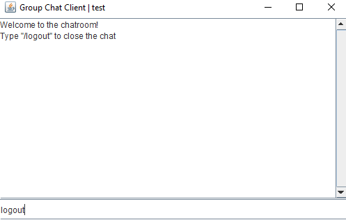

# Group-Chat-Client-Server-Java-Sockets-
This is a barebones proof of concept multi-user group chat using java sockets.  

I created this just as a project to push my skills in Java programming. 

# Having trouble with the server when you close the client?
- Sometimes the server doesnt understand that the client has exited, so to exit correctly type "logout" in the client.

# Want to know what ip the server is using? 
- The person running the server can go to https://whatismyipaddress.com to find the IP.
